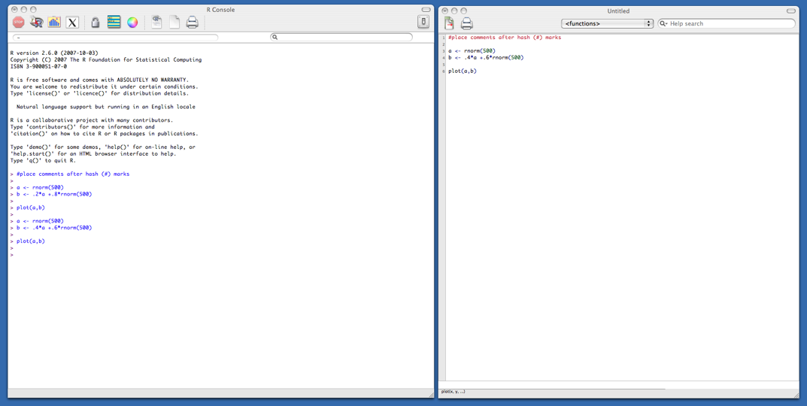

## History of R

 - S: language for data analysis developed at Bell Labs circa 1976
 - Licensed by AT&T/Lucent to Insightful Corp. Product name: S-plus.
 - R: initially written & released as an open source software by Ross Ihaka and Robert Gentleman at U Auckland during 90s (R plays on name 'S')
 - Since 1997: international R-core team ~15 people & 1000s of code writers and statisticians happy to share their libraries! AWESOME!

---

## “Open source”... that just means I don’t have to pay for it, right?

### No. Much more:
 - Provides full access to algorithms and their implementation
 - Gives you the ability to fix bugs and extend software
 - Provides a forum allowing researchers to explore and expand the methods used to analyze data
 - Is the product of 1000s of leading experts in the fields they know best. It is CUTTING EDGE. 
 - Ensures that scientists around the world - and not just ones in rich countries - are the co-owners to the software tools needed to carry out research
 - Promotes reproducible research by providing open and accessible tools
 - Most of R is written in… R! This makes it quite easy to see what functions are actually doing.

---

## What is it?

### R is an interpreted computer language.
 - Most user-visible functions are written in R itself, calling upon a smaller set of internal primitives. 
 - It is possible to interface procedures written in C, C+, or FORTRAN languages for efficiency, and to write additional primitives.
 - System commands can be called from within R

---

## What is it?

### R is used for data manipulation, statistics, and graphics. It is made up of:
 - operators (+  -  <-  *  %*%  …) for calculations on arrays & matrices
 - large, coherent, integrated collection of functions
 - facilities for making unlimited types of publication quality graphics
 - user written functions & sets of functions (packages); 800+ contributed packages so far & growing

--- &twocol w1:50% w2:50%

## R

*** left
### Advantages
 - Fast and free.
 - State of the art: Statistical researchers provide their methods as R packages. SPSS and SAS are   years behind R!
 - 2nd only to MATLAB for graphics.
 - Mx, WinBugs, and other programs use or will use R.
 - Active user community
 - Excellent for simulation, programming, computer intensive analyses, etc.
 - -Forces you to think about your analysis.
 - Interfaces with database storage software (SQL)

*** right

--- &twocol w1:50% w2:50%

## R

*** left
### Advantages
 - Fast and free.
 - State of the art: Statistical researchers provide their methods as R packages. SPSS and SAS are   years behind R!
 - 2nd only to MATLAB for graphics.
 - Mx, WinBugs, and other programs use or will use R.
 - Active user community
 - Excellent for simulation, programming, computer intensive analyses, etc.
 - Forces you to think about your analysis.
 - Interfaces with database storage software (SQL)

*** right
### Disadvantages
 - Not user friendly @ start -  steep learning curve, minimal GUI.
 - No commercial support; figuring out correct methods or how to use a function on your own can be frustrating.
 - Easy to make mistakes and not know. 
 - Working with (*very*) large datasets is limited by RAM
 - Data prep & cleaning can be messier & more mistake prone in R vs. SPSS or SAS
 - Some users complain about hostility on the R listserve

---
## Learning R...

<figure>
  
</figure>

---
## R-help listserve...

<figure>
  
</figure>

--- &twocol w1:50% w2:50%

## R vs. 

*** left
### R
 - Many different datasets (and other “objects”) available at same time
 - Datasets can be of any dimension
 - Functions can be modified
 - Experience is interactive-you program until you get exactly what you want
 - One stop shopping - almost every analytical tool you can think of is available
 - R is free and will continue to exist. Nothing can make it go away, its price will never increase. 

*** right
### Commercial

--- &twocol w1:50% w2:50%
## R vs.

*** left
### R
 - Many different datasets (and other “objects”) available at same time
 - Datasets can be of any dimension
 - Functions can be modified
 - Experience is interactive-you program until you get exactly what you want
 - One stop shopping - almost every analytical tool you can think of is available
 - R is free and will continue to exist. Nothing can make it go away, its price will never increase. 

*** right
### Commercial
 - One datasets available at a given time
 - Datasets are rectangular
 - Functions are proprietary
 - Experience is passive-you choose an analysis and they give you everything they think you need
 - Tend to be have limited scope, forcing you to learn additional programs; extra options cost more and/or require you to learn a different language (e.g., SPSS Macros)
 - They cost money. There is no guarantee they will continue to exist, but if they do, you can bet that their prices will always increase

---
## There are over 800 add-on packages 

- This is an enormous advantage - new techniques available without delay, and they can be performed using the R language you already know.
- Allows you to build a customized statistical program suited to your own needs. 
- Downside = as the number of packages grows, it is becoming difficult to choose the best package for your needs, & QC is an issue.

---
## Typical R session

- Start up R via the GUI or favorite text editor
- Two windows:
    - 1+ new or existing scripts (text files) - these will be saved 
    - Terminal – output & temporary input - usually unsaved

<figure>
  
</figure>

---
## Typical R session

- R sessions are interactive
- At end, all you need to do is save your script file(s) - which can easily be rerun later. 

<figure>
  
</figure>

---
## R objects
- Almost all things in R – functions, datasets, results, etc. – are OBJECTS.  
(graphics are written out and are not stored as objects)
- Script can be thought of as a way to make objects. Your goal is usually to write a script that, by its end, has created the objects (e.g., statistical results) and graphics you need. 
- Objects are classified by two criteria:
    - MODE: how objects are stored in R - character, numeric, logical, factor, list, & function 
    - CLASS: how objects are treated by functions (important to know!) - [vector], matrix, array, data.frame, & hundreds of special classes created by specific functions

---
## Learning R

1. Check out the course wikisite - lots of good manuals & links
2. Read through the CRAN website
3. Use http://www.rseek.org/ instead of google
4. Know your objects’ classes: class(x) or info(x)
5. Because R is interactive, errors are your friends!
6. ?lm    gives you help on lm function. Reading help files can be very… helpful
7. MOST IMPORTANT - the more time you spend using R, the more comfortable you become with it. After doing your first real project in R, you won’t look back. I promise.

--- .class = 'segue quote'
## Final Words of Warning

<q>Using R is a bit akin to smoking. 
The beginning is difficult, one may get headaches
and even gag the first few times. 
But in the long run, it becomes pleasurable and even addictive. 
Yet, deep down, for those willing to be honest, there is 
something not fully healthy in it.</q>

 --Francois Pinard

---
## Acknowledgements

Some material cribbed from: Matthew Keller, UCLA Academic Technology Services Technical Report Series (by Patrick Burns) and presentations (found online) by Bioconductor, Wolfgang Huber and Hung Chen, & various Harry Potter websites.

This presentation was written in [RMarkdown](http://www.rstudio.com/ide/docs/authoring/using_markdown) using [Slidify](http://slidify.org/).
